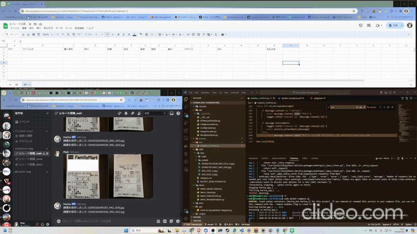
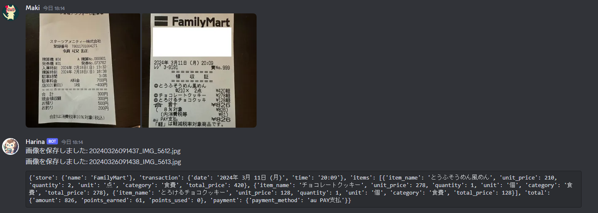
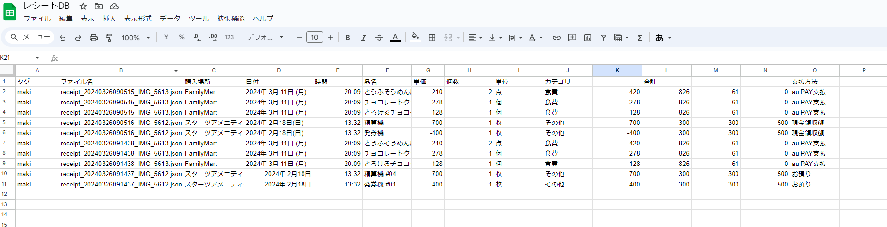

<p align="center">

<br>
<h1 align="center">HARINA</h1>
<h2 align="center">
  Home Accounting and Resource Information Network Assistant
<br>
  
<a href="https://github.com/Sunwood-ai-labs/Harina" title="Go to GitHub repo"></a>

<a href="https://github.com/Sunwood-ai-labs/Harina"></a>
<a href="https://github.com/Sunwood-ai-labs/Harina"></a>
<a href="https://github.com/Sunwood-ai-labs/Harina"></a>


<br>
<p align="center">
  <a href="https://hamaruki.com/"><b>[🌐 Website]</b></a> •
  <a href="https://github.com/Sunwood-ai-labs"><b>[🐱 GitHub]</b></a>
  <a href="https://twitter.com/hAru_mAki_ch"><b>[🐦 Twitter]</b></a> •
  <a href="https://hamaruki.com/harina-receipt-analysis-discord-bot-app-using-claude-3-haiku"><b>[🍀 Official Blog]</b></a>
</p>

</h2>

</p>

このDiscord botは、ユーザーが送信したレシート画像を解析し、高速かつ効率的なAIモデル（Claude 3 HaikuおよびGPT-4o）を使用して関連情報を抽出します。

抽出されたデータは、Google Apps Script（GAS）を介してGoogle スプレッドシートに自動的に送信され、さらなる分析や保存が可能です。



## 主な特徴

- **高速レシート解析**
  - Claude 3 HaikuモデルとLiteLLMを使用して、レシート画像から瞬時にJSONデータへ変換
  - 店舗名、取引日、購入商品、合計金額、支払方法などの関連情報を高精度で抽出

- **シームレスなGoogle スプレッドシート連携**
  - 抽出されたデータを自動的にGoogle スプレッドシートに送信
  - データの永続的な保存と詳細な分析が可能

- **マルチチャンネルサポートとカスタマイズ可能な設定**
  - 複数のDiscordチャンネルでの動作をサポート
  - チャンネルIDに基づいて画像の保存先を柔軟に設定可能

- **Dockerを使用した簡単セットアップ**
  - Dockerを使用して、Discord botの環境を迅速かつ簡単に構築
  - Python環境やパッケージのインストールが不要

## 更新情報

- **v1.1.0**: ReceiptAnalyzerのリファクタリング、GPT-4oの画像解析機能の追加、LiteLLMの統合

## セットアップ

### リポジトリをクローンし、プロジェクトディレクトリに移動します：

```bash
git clone https://github.com/your-username/receipt-analyzer-discord-bot.git
cd receipt-analyzer-discord-bot
```

### Google Apps Scriptを設定します：

- `gas/JSON to Spreadsheet Integrator.js`ファイルを開きGASにコピーします。
- `'スプレッドシートのID'`をご自身のGoogle スプレッドシートのIDに置き換えます。
- `'シート名'`をデータの保存先となるシートの名前に置き換えます。
- スクリプトをウェブアプリとして公開し、URLをコピーします。

### 環境変数を設定します：

- `DISCORD_BOT_TOKEN_HARINA`：Discord botトークン
- `ANTHROPIC_API_KEY`：Anthropic APIキー（Claude 3 Haikuモデルの使用に必要）
- `GAS_JSON2GSS_URL`：公開済みのGoogle Apps ScriptのURL

これらの変数は、`.env`ファイルまたはシステム環境変数として設定できます。

### Docker Composeを使用してbotを実行します：

```bash
docker-compose up
```

これで、botが実行され、設定されたチャンネルでレシート画像をリッスンするようになります。

## 使用方法

1. 設定されたDiscordチャンネルの1つでレシート画像を送信します。
2. botは画像を解析し、Claude 3 HaikuモデルおよびGPT-4oを使用して画像からJSONデータへ変換します。



3. 関連情報を抽出して、抽出されたデータを含むフォーマット済みのメッセージを送信します。
4. 抽出されたデータは、さらなる分析と保存のために、指定されたGoogle スプレッドシートにも自動的に送信されます。



